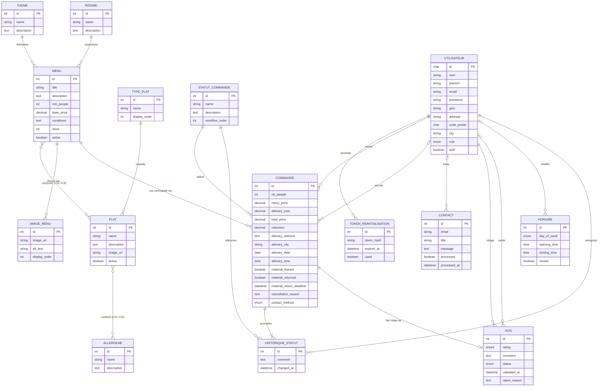
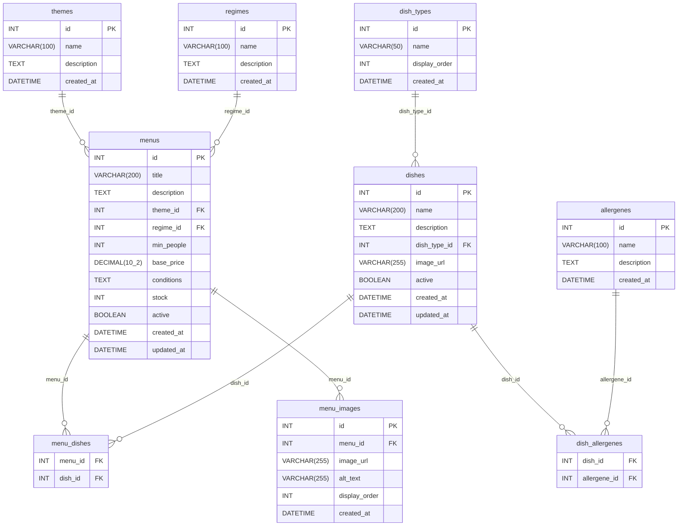
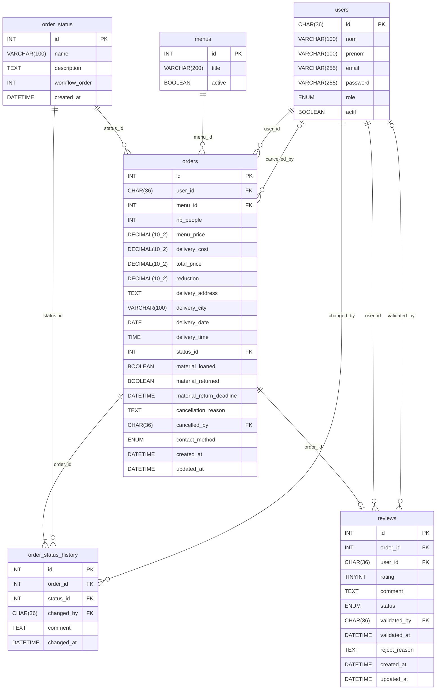
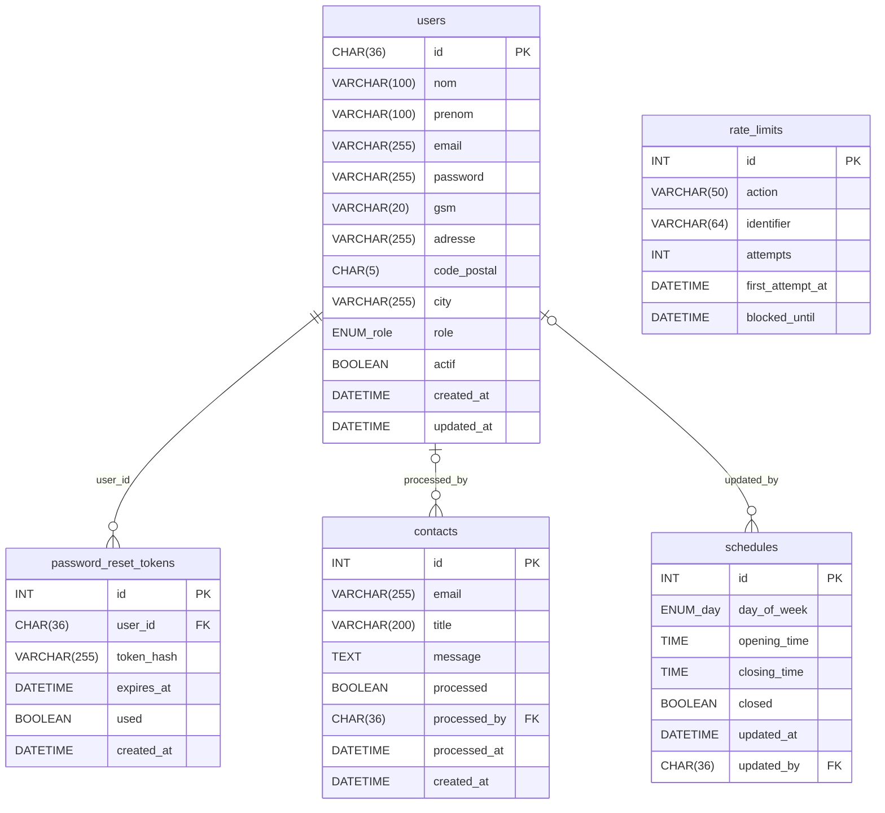

# Modèle de Données — Vite & Gourmand

**SGBD :** MariaDB | **Base :** `vite_et_gourmand`

---

## Sommaire

1. [MCD — Modèle Conceptuel de Données](#1-mcd--modèle-conceptuel-de-données)
2. [MLD — Modèle Logique de Données](#2-mld--modèle-logique-de-données)
   - [Domaine Catalogue](#21-domaine-catalogue)
   - [Domaine Commandes](#22-domaine-commandes)
   - [Domaine Utilisateurs & Sécurité](#23-domaine-utilisateurs--sécurité)
3. [Dictionnaire de données](#3-dictionnaire-de-données)
4. [Conventions et notes](#4-conventions-et-notes)

---

## 1. MCD — Modèle Conceptuel de Données

### Cardinalités

| Notation Mermaid | Signification |
| --- | --- |
| `\|\|` | Exactement 1 |
| `\|o` | 0 ou 1 |
| `o{` | 0 ou plusieurs |
| `\|{` | 1 ou plusieurs |

---

## 2. MLD — Modèle Logique de Données

### 2.1 Domaine Catalogue

Gère le référentiel des plats, menus, thèmes, régimes et allergènes.

### 2.2 Domaine Commandes

Gère le cycle de vie des commandes, le suivi des statuts et les avis clients.

### 2.3 Domaine Utilisateurs & Sécurité

Gère les comptes utilisateurs, l'authentification, les messages de contact, les horaires et la limitation de débit.

---

## 3. Dictionnaire de données

### Table `users`

| Colonne | Type | Contrainte | Description |
| --- | --- | --- | --- |
| `id` | `CHAR(36)` | PK, DEFAULT UUID() | Identifiant UUID unique |
| `nom` | `VARCHAR(100)` | NOT NULL | Nom de famille |
| `prenom` | `VARCHAR(100)` | NOT NULL | Prénom |
| `email` | `VARCHAR(255)` | NOT NULL, UNIQUE | Adresse email (login) |
| `password` | `VARCHAR(255)` | NOT NULL | Mot de passe haché (bcrypt) |
| `gsm` | `VARCHAR(20)` | NULL | Numéro de téléphone |
| `adresse` | `VARCHAR(255)` | NULL | Adresse postale |
| `code_postal` | `CHAR(5)` | NULL | Code postal |
| `city` | `VARCHAR(255)` | NULL | Ville |
| `role` | `ENUM('user','employe','admin')` | DEFAULT 'user' | Rôle applicatif |
| `actif` | `BOOLEAN` | DEFAULT TRUE | Compte actif/désactivé |
| `created_at` | `DATETIME` | DEFAULT NOW() | Date de création |
| `updated_at` | `DATETIME` | ON UPDATE NOW() | Dernière modification |

### Table `menus`

| Colonne | Type | Contrainte | Description |
| --- | --- | --- | --- |
| `id` | `INT` | PK, AUTO_INCREMENT | Identifiant |
| `title` | `VARCHAR(200)` | NOT NULL | Intitulé du menu |
| `description` | `TEXT` | NULL | Description détaillée |
| `theme_id` | `INT` | FK → themes | Thème culinaire |
| `regime_id` | `INT` | FK → regimes | Régime alimentaire |
| `min_people` | `INT` | NOT NULL, DEFAULT 1 | Nombre minimum de personnes |
| `base_price` | `DECIMAL(10,2)` | NOT NULL | Prix de base par personne |
| `conditions` | `TEXT` | NULL | Conditions particulières |
| `stock` | `INT` | DEFAULT 0 | Nombre de menus disponibles |
| `active` | `BOOLEAN` | DEFAULT TRUE | Menu visible en catalogue |

### Table `orders`

| Colonne | Type | Contrainte | Description |
| --- | --- | --- | --- |
| `id` | `INT` | PK, AUTO_INCREMENT | Identifiant commande |
| `user_id` | `CHAR(36)` | FK → users | Client commandant |
| `menu_id` | `INT` | FK → menus | Menu commandé |
| `nb_people` | `INT` | NOT NULL | Nombre de personnes |
| `menu_price` | `DECIMAL(10,2)` | NOT NULL | Prix menu à l'instant T |
| `delivery_cost` | `DECIMAL(10,2)` | DEFAULT 0 | Frais de livraison |
| `total_price` | `DECIMAL(10,2)` | NOT NULL | Total TTC |
| `reduction` | `DECIMAL(10,2)` | DEFAULT 0 | Réduction appliquée |
| `delivery_address` | `TEXT` | NOT NULL | Adresse de livraison |
| `delivery_city` | `VARCHAR(100)` | NOT NULL | Ville de livraison |
| `delivery_date` | `DATE` | NOT NULL | Date de livraison souhaitée |
| `delivery_time` | `TIME` | NOT NULL | Heure de livraison souhaitée |
| `status_id` | `INT` | FK → order_status | Statut courant |
| `material_loaned` | `BOOLEAN` | DEFAULT FALSE | Matériel prêté au client |
| `material_returned` | `BOOLEAN` | DEFAULT FALSE | Matériel restitué |
| `material_return_deadline` | `DATETIME` | NULL | Date limite de retour matériel |
| `cancellation_reason` | `TEXT` | NULL | Motif d'annulation |
| `cancelled_by` | `CHAR(36)` | FK → users, NULL | Auteur de l'annulation |
| `contact_method` | `ENUM('email','telephone')` | NULL | Méthode de contact préférée |

### Table `reviews`

| Colonne | Type | Contrainte | Description |
| --- | --- | --- | --- |
| `id` | `INT` | PK, AUTO_INCREMENT | Identifiant |
| `order_id` | `INT` | FK → orders, UNIQUE | Commande évaluée (1 seul avis) |
| `user_id` | `CHAR(36)` | FK → users | Auteur de l'avis |
| `rating` | `TINYINT` | CHECK 1..5 | Note de 1 à 5 |
| `comment` | `TEXT` | NULL | Commentaire libre |
| `status` | `ENUM('pending','approved','rejected')` | DEFAULT 'pending' | État de modération |
| `validated_by` | `CHAR(36)` | FK → users, NULL | Modérateur (employé/admin) |
| `validated_at` | `DATETIME` | NULL | Date de modération |
| `reject_reason` | `TEXT` | NULL | Raison de rejet |

---

## 4. Conventions et notes

### Clés primaires

- `users.id` utilise `CHAR(36)` avec `DEFAULT (UUID())` — identifiant non prédictible pour la sécurité.
- Toutes les autres tables utilisent `INT AUTO_INCREMENT`.

### Horodatage

- `created_at` : positionné à `DEFAULT CURRENT_TIMESTAMP`, jamais mis à jour.
- `updated_at` : positionné à `ON UPDATE CURRENT_TIMESTAMP`, suit automatiquement chaque modification.

### Workflow des statuts commande

| Ordre | Statut | Description |
| --- | --- | --- |
| 1 | En attente | Reçue, en attente de validation |
| 2 | Acceptée | Validée par l'équipe |
| 3 | En préparation | En cours de préparation |
| 4 | En cours de livraison | Expédiée |
| 5 | Livrée | Reçue par le client |
| 6 | En attente du retour de matériel | Matériel prêté à récupérer |
| 7 | Terminée | Cycle complet |
| 8 | Annulée | Commande annulée |

Chaque changement de statut est archivé dans `order_status_history` avec l'auteur du changement.

### Référentiel allergènes

14 allergènes déclarés conformément à la réglementation européenne (INCO) :
Gluten, Crustacés, Œufs, Poissons, Arachides, Soja, Lactose, Fruits à coque, Céleri, Moutarde, Sésame, Sulfites, Lupin, Mollusques.

### Table technique `rate_limits`

Table de sécurité applicative (anti-brute-force) : non modélisée dans le MCD car elle n'appartient pas au domaine métier. Elle stocke les tentatives par `action` (ex. `login`) et `identifier` (IP ou email haché).

### Rôles utilisateurs

| Rôle | Accès |
| --- | --- |
| `user` | Catalogue, commandes propres, avis |
| `employe` | Gestion commandes, modération avis, plats et menus, horaires |
| `admin` | Accès complet + gestion des employés |
